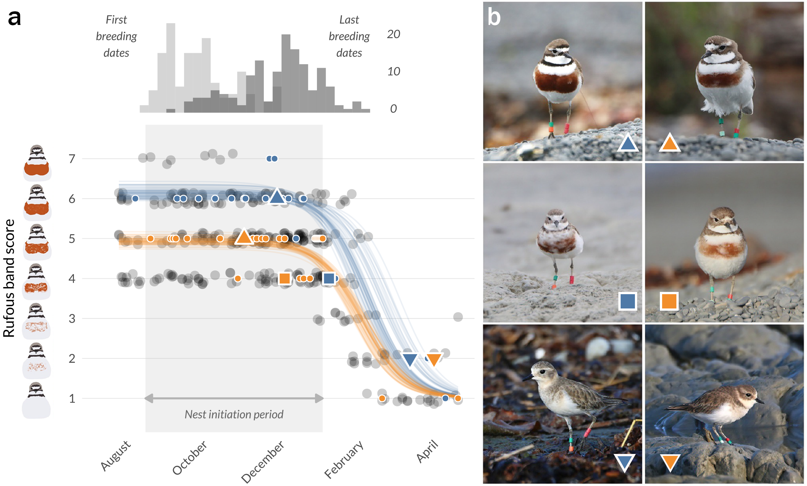

# Reproducible datasets and code for:

## Persistent Individual Differences and Age Shape Post-Breeding Molt Dynamics in a Partially Migratory Shorebird

### *in preparation*

#### Luke Eberhart-Hertel1, Bashar Jarayseh1, Ailsa McGilvary-Howard2, Ted Howard2, Tony Habraken3, Colin F. J. O’Donnell4, Emma M. Williams4, and Bart Kempenaers1

1)  *Max Planck Institute for Biological Intelligence, Department of
    Ornithology, Eberhard-Gwinner-Straße 7/8, 82319 Seewiesen, Germany*
2)  *Kaikōura Banded Dotterel Project, Kaikōura, New Zealand*
3)  *Port Waikato Banded Dotterel Project, Port Waikato, New Zealand*
4)  *Fauna Science Team, Department of Conservation Christchurch Office, 
    Christchurch Mail Centre, Private Bag 4715, Christchurch, 8140, New Zealand*

✉ For correspondence regarding the data and code in this repository and the study system, please
contact: Luke
(<a href= "mailto:luke.eberhart@bi.mpg.de">luke.eberhart[at]bi.mpg.de</a>)

This repository contains the data objects, fitted model objects, and Quarto source code needed to reproduce the analyses and reported results for our investigation of individual variation in post-breeding molt of banded dotterels (*Anarhynchus bicinctus*) breeding in Kaikōura, New Zealand.

For a complete overview of the methods and results presented in the manuscript, see the rendered project vignette: [banded_dotterel_moult.html](https://leberhartphillips.github.io/bdot_moult/banded_dotterel_moult.html)

## Reproducing the analysis

To reproduce the results shown in the manuscript and Quarto document:

1. Clone this repository and open [`moult.Rproj`](moult.Rproj) in RStudio.
2. Ensure the files listed below are present locally; these are the data and model objects sourced by [`banded_dotterel_moult.qmd`](banded_dotterel_moult.qmd).
3. Install the R packages referenced in the Quarto document.
4. Render [`banded_dotterel_moult.qmd`](banded_dotterel_moult.qmd) to regenerate the HTML vignette and tables/figures.

#### Repository Contents

- [`README.md`](https://github.com/leberhartphillips/bdot_moult/blob/main/README.md)
  Landing page and file inventory for reproducibility.
- [`.gitignore`](https://github.com/leberhartphillips/bdot_moult/blob/main/.gitignore)
  Git allowlist for the reproducibility-focused repository subset.
- [`banded_dotterel_moult.qmd`](https://github.com/leberhartphillips/bdot_moult/blob/main/banded_dotterel_moult.qmd)
  Quarto source code for the full analysis vignette.
- [`banded_dotterel_moult.html`](https://github.com/leberhartphillips/bdot_moult/blob/main/banded_dotterel_moult.html)
  Rendered HTML vignette.
- [`moult.Rproj`](https://github.com/leberhartphillips/bdot_moult/blob/main/moult.Rproj)
  RStudio project file.
- [`LICENSE`](https://github.com/leberhartphillips/bdot_moult/blob/main/LICENSE)
  Repository license.
- [`figs/fig2.png`](https://github.com/leberhartphillips/bdot_moult/blob/main/figs/fig2.png)
  Figure displayed in this README.

[**`data/`**](https://github.com/leberhartphillips/bdot_moult/tree/main/data)
Datasets needed to reproduce analyses presented in [`banded_dotterel_moult.qmd`](banded_dotterel_moult.qmd)

- [`data/moult_breeding_KK_data.rds`](https://github.com/leberhartphillips/bdot_moult/blob/main/data/moult_breeding_KK_data.rds)
  Main dataset used for the molt analyses.
- [`data/breeding_KK_data.rds`](https://github.com/leberhartphillips/bdot_moult/blob/main/data/breeding_KK_data.rds)
  Breeding dataset used in the auxiliary breeding-phenology analyses.
- [`data/nests_KK_data.rds`](https://github.com/leberhartphillips/bdot_moult/blob/main/data/nests_KK_data.rds)
  Nest dataset used in the auxiliary nest analyses.

[**`out/`**](https://github.com/leberhartphillips/bdot_moult/tree/main/out)
Model output produced by brms models presented in [`banded_dotterel_moult.qmd`](banded_dotterel_moult.qmd)

- [`out/sex_mod.rds`](https://github.com/leberhartphillips/bdot_moult/blob/main/out/sex_mod.rds)
  Sex-specific model output
- [`out/sex_all_3_breed_mod.rds`](https://github.com/leberhartphillips/bdot_moult/blob/main/out/sex_all_3_breed_mod.rds)
  Breeding phenology model output
- [`out/sex_age_class_mod.rds`](https://github.com/leberhartphillips/bdot_moult/blob/main/out/sex_age_class_mod.rds)
  Age class model output
- [`out/sex_age_avg_mod.rds`](https://github.com/leberhartphillips/bdot_moult/blob/main/out/sex_age_avg_mod.rds)
  Continuous age model output
- [`out/sex_migratory_status_mod.rds`](https://github.com/leberhartphillips/bdot_moult/blob/main/out/sex_migratory_status_mod.rds)
  Migratory status model output
- [`out/kfc_age_class.rds`](https://github.com/leberhartphillips/bdot_moult/blob/main/out/kfc_age_class.rds)
  Age class model 10-fold cross-validation
- [`out/kfc_age_avg.rds`](https://github.com/leberhartphillips/bdot_moult/blob/main/out/kfc_age_avg.rds)
  Continuous age model 10-fold cross-validation
- [`out/mod_mig_lay_brms.rds`](https://github.com/leberhartphillips/bdot_moult/blob/main/out/mod_mig_lay_brms.rds)
  Auxillary analysis: Breeding phenology and migratory status
- [`out/mod_mig_first_brms.rds`](https://github.com/leberhartphillips/bdot_moult/blob/main/out/mod_mig_first_brms.rds)
  Auxillary analysis: Breeding phenology and migratory status
- [`out/mod_mig_last_brms.rds`](https://github.com/leberhartphillips/bdot_moult/blob/main/out/mod_mig_last_brms.rds)
  Auxillary analysis: Breeding phenology and migratory status
- [`out/mod_age_lay_brms.rds`](https://github.com/leberhartphillips/bdot_moult/blob/main/out/mod_age_lay_brms.rds)
  Auxillary analysis: Age and migratory status
- [`out/mod_age_first_brms.rds`](https://github.com/leberhartphillips/bdot_moult/blob/main/out/mod_age_first_brms.rds)
  Auxillary analysis: Age and migratory status
- [`out/mod_age_last_brms.rds`](https://github.com/leberhartphillips/bdot_moult/blob/main/out/mod_age_last_brms.rds)
  Auxillary analysis: Age and migratory status
- [`out/mod_age2_lay_brms.rds`](https://github.com/leberhartphillips/bdot_moult/blob/main/out/mod_age2_lay_brms.rds)
  Auxillary analysis: Age and migratory status
- [`out/mod_age2_first_brms.rds`](https://github.com/leberhartphillips/bdot_moult/blob/main/out/mod_age2_first_brms.rds)
  Auxillary analysis: Age and migratory status
- [`out/mod_age2_last_brms.rds`](https://github.com/leberhartphillips/bdot_moult/blob/main/out/mod_age2_last_brms.rds)
  Auxillary analysis: Age and migratory status
- [`out/sex_age2_avg_mod.rds`](https://github.com/leberhartphillips/bdot_moult/blob/main/out/sex_age2_avg_mod.rds)
  Auxillary analysis: Age and migratory status
- [`out/sex_all_3_breed_mod2.rds`](https://github.com/leberhartphillips/bdot_moult/blob/main/out/sex_all_3_breed_mod2.rds)
  Auxillary analysis: Age and migratory status
- [`out/sex_all_3_breed_mod3.rds`](https://github.com/leberhartphillips/bdot_moult/blob/main/out/sex_all_3_breed_mod3.rds)
  Auxillary analysis: Age and migratory status

These files are the objects currently sourced by the Quarto document and are the minimum set that should remain tracked if the repository is reduced to a reproducibility-focused subset.